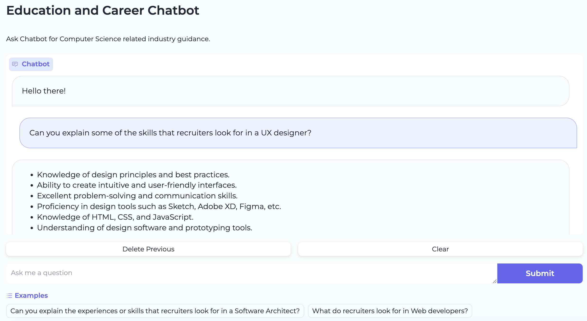
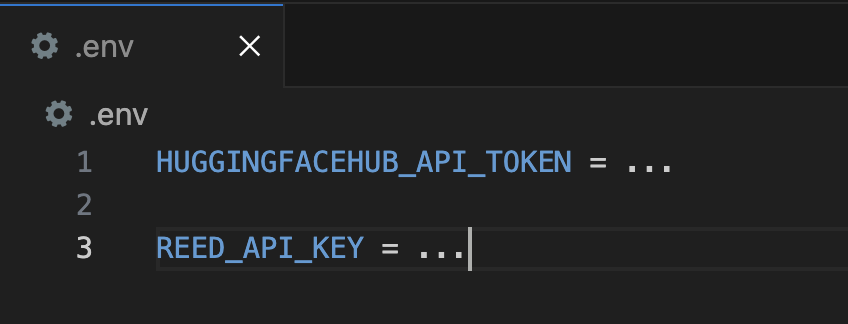

# agile_llm

## Project description

In collaboration with IBM, this project investigates the possibility of creating more agile, timely relevant content using a combination of prompt engineering, a fine-tuned model, and Retrieval-Augmented Generation (RAG) in the adapted pipeline.

The final product is extracting job information from a real-time Job API (Reed) and performing relevant analysis to provide a response that is more timely and domain-specific to the particular Computer Science job in the user query. This project hopes to guide online learning platforms or students by providing insights on, for example, the skills or responsibilities, of the current workplace in the tech industry.

## Organisation

### Two Jupyter notebooks

Jupyter notebooks are used to explore the LLM techniques and their effectiveness in the final pipeline. They are used to run experiments to explore the Research Questions in the dissertation. The two notebooks are:

- finetuned_model.ipynb: used to investigate RQ1. comparing pre-trained and fine-tuned model with the same prompt (BERTScore and static manual evaluation)
- pipeline_eval.ipynb: used to investigate RQ2 and RQ3. Uses the fine-tuned model that was better performing in the last step, and performing RAG on job API and evaluation for this stage (UniEval Framework and static manual evaluation)

#### Requirements

These Jupyter notebooks are to be run on Google Colab and a Pro subscription would be required because the evaluation implemented requires GPU use and additional memory. Note that running the notebooks would use up compute units. The specific runtime used was V100 GPU for the experiments.

As all results findings and model outputs are directly included in the dissertation's Evaluation and Appendix, you don't necessarily need to run the notebooks, but they are still made available for viewing and transparency.To open the Jupyter notebooks on Google Colab: Go to https://colab.google/ > Open Colab > Upload > Browse > and then select the specific notebook from the directory to open. An alternative shortcut is to click the 'Open in Colab' link on top of the specific notebook file (if it is available).

### Final implementation with Gradio interface

The final pipeline and LLM application is in app.py which can be run locally on a machine. To run it, you must first install libraries and dependencies from requirements.txt with the command: `pip install -r requirements.txt`

#### Include API Tokens in the .env file

You must have a .env file in the same directory as app.py with your

- HUGGINGFACEHUB_API_TOKEN = ...
- REED_API_KEY = ...

For guidance, the .env file should look like this:

Get your HuggingFace token here: https://huggingface.co/docs/api-inference/quicktour#get-your-api-token

You can sign up for the Reed API token here: https://www.reed.co.uk/developers/jobseeker

#### Run application interface

In the terminal, run
`python3 app.py `
and specified local web URL will be given where you can open the Gradio demo on your browser.

Please be aware of the hourly usage limits of the Reed Job API.

Part of the pipeline is to automatically search for relevant jobs from the Reed Job API based on the user query, and the job listings returned is collected into the job_listings.csv file. Therefore the job_listings.csv file is to serve as the retrieval source for the LLM to perform Retrieval-Augmented Generation and is dynamically updated each time the user queries the chatbot.

#### Troubleshooting

If you encounter an ImportError related to a specific library, it may be due to installation issues or compatibility problems. In such cases, you can try reinstalling the library using the --force-reinstall flag with pip. E.g. `pip install --force-reinstall replace_library_name_here`

### Testing

Methods functionality is tested in test_app.py. To run the test file, similarly to the prerequisites for app.py, you would need to have the .env file with your HuggingFace API and Reed API tokens.

### Evaluation of CSV files

The 'cs' and 'industry' folders contain CSV files containing the output of the models that are generated from the notebooks for evaluation purposes. These can be viewed (for transparency) but can be ignored as they are included in the Appendix with additional manual evaluation annotations.
